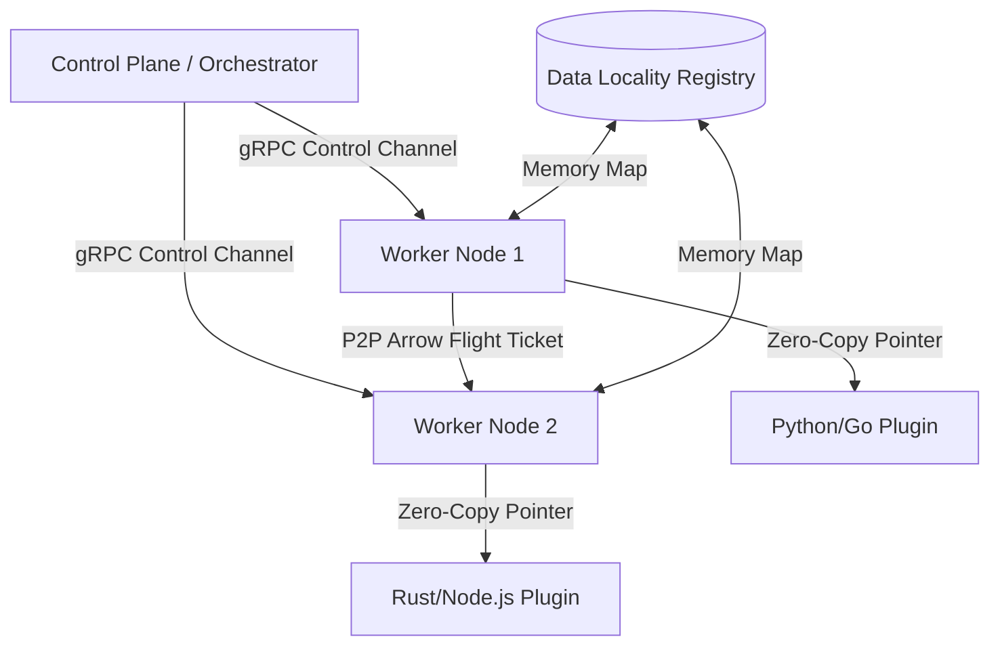
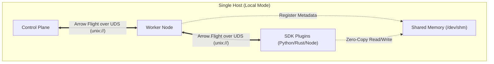
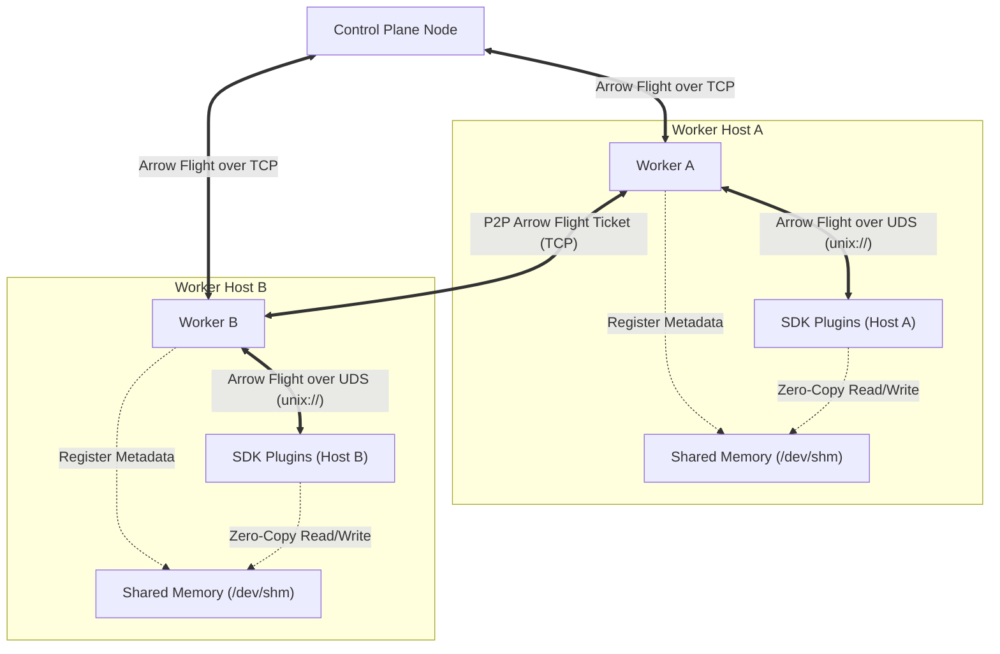

# Heddle Agent Onboarding Guide

## 1. Document Scope and Conventions

This section defines the boundary and expectations of this onboarding guide.

*   **Scope:** This document explains the global repository layout, core system concepts, and basic compiler-to-execution pipelines.
*   **Non-Scope:** This guide does not cover individual Software Development Kit (**SDK**) implementations for external languages (such as Python, Node.js, or Rust). It also excludes detailed syntax references for the Heddle Domain-Specific Language (**DSL**), which reside in the `./docs/` directory.

---

## 2. Project Purpose

Heddle is a strictly-typed, domain-specific programming language (**DSL**) and high-performance orchestration engine. It eliminates orchestration debt caused by fragmented microservices, untyped pipelines, and heavy serialization. Heddle provides a unified orchestration layer that bridges functional safety and imperative utility.

The engine achieves high efficiency by separating the control plane from the data plane:
*   **Zero-Copy Exchange:** Heddle leverages **Apache Arrow** and **Arrow Flight** to share universal memory addresses across multi-language runtimes at RAM speeds.
*   **Decoupled Architecture:** The control plane coordinates the execution flow, whereas independent workers handle the physical data streams.
*   **Relational Logic:** The Heddle language integrates Pipelined Relational Query Language (**PRQL**) directly for side-effect-free data transformations.

---

## 3. Directory Layout

The Heddle repository organizes its components into logical modules to isolate compilation, runtime execution, and developer tooling. Below is a structured breakdown of the repository:

```plaintext
/
├── cmd/                  # CLI command definitions and tool entrypoints
├── internal/             # Core backend services and engine implementations
├── pkg/                  # Shared compiler, AST, and runtime libraries
├── docs/                 # Project documentation and language specifications
├── examples/             # Sample workflows demonstrating language features
└── Makefile              # Task automation scripts for building and testing
```

### 3.1 CLI Layer (`/cmd/`)

The `/cmd/` directory houses the command-line interface (**CLI**) logic. The main CLI application uses the Cobra library to register and coordinate the following subcommands:

*   [`/cmd/main.go`](./cmd/main.go): The entry point for the global `heddle` command. It initializes the logger and parses user-supplied configuration flags.
*   [`/cmd/run/`](./cmd/run/): Provides the subcommand to execute a Heddle script directly, registered under the `workflow` command.
*   [`/cmd/local/`](./cmd/local/): Implements the command for local single-node execution.
*   [`/cmd/cluster/`](./cmd/cluster/): Configures and launches a multi-node cluster deployment.
*   [`/cmd/dev/`](./cmd/dev/): Orchestrates local developer services. It starts the Language Server Protocol (**LSP**) server, the Debug Adapter Protocol (**DAP**) server, and file-watching daemons.
*   [`/cmd/inspect/`](./cmd/inspect/): Provides utilities to inspect the Abstract Syntax Tree (**AST**) and compiled Intermediate Representation (**IR**).
*   [`/cmd/workflow/`](./cmd/workflow/): Manages and lists workflow definitions.

### 3.2 Service Layer (`/internal/`)

The `/internal/` directory contains private backend services. These services handle state coordination, client communication, and execution environments:

*   [`/internal/control-plane/`](./internal/control-plane/): Implements the master orchestrator.
    *   `control_plane.go`: Manages active worker registrations, plugin lifecycles, and global execution states.
    *   `orchestrator/`: Schedules Directed Acyclic Graph (**DAG**) tasks and provisions Just-In-Time (**JIT**) workers.
    *   `registry/`: Tracks available resources, system workers, and active plugins.
*   [`/internal/worker/`](./internal/worker/): Contains worker-node execution logic.
    *   `worker.go`: Executes tasks assigned by the control plane.
    *   `plugin_server.go`: Spawns and manages individual polyglot executor plugins.
    *   `plugin_local.go` & `plugin_remote.go`: Establish high-performance Remote Procedure Call (**RPC**) channels between the worker and language-specific plugins.
*   [`/internal/lsp/`](./internal/lsp/): Hosts the Heddle language server. It supports rich editor features, including auto-completion, diagnostics, hover documentation, rename operations, and code formatting.
*   [`/internal/dap/`](./internal/dap/): Houses the debugger backend. It enables developers to set breakpoints, pause execution, and inspect variables.
*   [`/internal/dev/`](./internal/dev/): Integrates bootstrapping, scaffolding, and orchestration helpers.
*   [`/internal/config/`](./internal/config/): Parses configuration files and manages environment settings.

### 3.3 Core Shared Libraries (`/pkg/`)

The `/pkg/` directory exposes reusable packages utilized by the compiler, the CLI, and the workers:

*   [`/pkg/lang/`](./pkg/lang/): The Heddle language compiler toolchain.
    *   `lexer/`: Performs lexical analysis and converts source code into a token stream.
    *   `parser/`: Parses the token stream into a concrete AST.
    *   `ast/`: Establishes the nodes and scoping contexts of the AST.
    *   `compiler/ir/`: Defines Heddle's structural intermediate instructions, including steps, imports, and resources.
    *   `compiler/validator.go`: Validates static type contracts and verifies pipeline dependencies.
    *   `compiler/lowerer.go`: Translates the validated AST into execution-ready IR.
*   [`/pkg/runtime/locality/`](./pkg/runtime/locality/): Implements the Data Locality Registry (**DLR**). It maps DAG outputs to physical memory handles to enable zero-copy routing via Apache Arrow.
*   [`/pkg/schema/`](./pkg/schema/): Enforces typed interface schemas on multi-language pipeline boundaries.
*   [`/pkg/plugin/`](./pkg/plugin/): Holds metadata and protocol configurations for plugins.
*   [`/pkg/logger/`](./pkg/logger/): A high-performance structured logging library wrapper.

---

## 4. Core Architecture

Heddle separates logical orchestration from physical data execution. This design secures high fault tolerance and minimizes network latency.



### 4.1 The Smart Control Plane (Orchestration)

The Control Plane manages global execution state and scheduling decisions. It never touches raw payload data, which prevents bandwidth bottlenecks:

*   **Operator Fusion:** The compiler merges adjacent steps into single optimized **Super Steps**. This reduces physical inter-process communication overhead.
*   **JIT Worker Provisioning:** Step implementations load into stateless workers dynamically. The worker caches execution binaries locally to ensure zero warm-up latency.
*   **CHASM State Isolation:** The Control Plane utilizes the CHASM engine to isolate failures. The system retries only the failed step or resource connector instead of re-running the entire DAG.

### 4.2 Polyglot Workers (Execution)

Workers execute the actual steps within the workflows:

*   **Main Worker Daemon:** A central background process running on each physical host. It manages local plugin lifecycles and communicates with the Control Plane.
*   **Polyglot Plugins:** Language-specific execution environments (supporting Go, Python, Rust, and Node.js) that execute business logic. The worker delegates work to these plugins using local Unix Domain Sockets (**UDS**) or RPC.
*   **Peer-to-Peer (P2P) Data Resolution:** Workers bypass the Control Plane when transmitting data payloads. They share lightweight Arrow Flight Tickets to coordinate direct memory transfers between hosts.

### 4.3 Data Locality Registry (Memory Management)

The memory-management subsystem implements high-speed data routing:

*   **Zero-Copy Routing:** Maps data outputs to physical RAM locations. Workers read data directly from local RAM instead of copying or serializing records.
*   **Arrow Flight Tickets:** Transmit metadata containing host addresses and memory keys. The worker fetches physical memory pointers using this metadata.
*   **Memory Offloading & GC:** Automatically transfers large datasets from RAM to disk when allocations exceed capacity. The garbage collector releases intermediate data blocks once downstream steps complete.

### 4.4 Polyglot SDK Plugins (Business Logic)

Polyglot Software Development Kit (**SDK**) Plugins implement the custom user-defined logic for individual workflow steps. The Heddle architecture decouples language-specific runtime environments from the core engine to support multi-language workflows without performance degradation. Developer business logic runs natively inside dedicated external processes, utilizing languages like Python, Rust, Go, or Node.js.

SDK Plugins interact with co-located worker nodes to register capabilities and execute tasks:
*   **Capability Registration:** Plugins send a metadata payload containing their namespace, supported step definitions, and structural schemas to the worker node during initialization.
*   **Task Delegation:** The worker node sends an execution request containing configuration parameters and shared memory input paths to the target plugin socket.
*   **Result Return:** The plugin executes the designated step function, writes the output data arrays to co-located shared memory segments, and returns the resulting output handle paths back to the worker.

### 4.5 Component Communication and Network Topologies

The orchestration engine adapts its communication channels depending on the physical deployment topology. To maximize throughput and minimize latency, Heddle combines high-efficiency Unix Domain Sockets (**UDS**) for local co-located processes with TCP/IP network sockets for distributed cluster communication.

The system manages inter-process communication across two distinct deployment modes.

#### Local (Single-Node) Mode

In local single-node execution, the system isolates all network traffic to local inter-process channels on the host machine. This configuration optimizes development and single-node processing workflows.



Local communication routes utilize the following pathways:
*   **Control Plane to Worker:** The Worker establishes a connection to the Control Plane using a Unix Domain Socket (**UDS**) (e.g., `unix:///tmp/heddle-control.sock`). This path completely bypasses the local TCP loopback network stack to eliminate operating system routing latency.
*   **Worker to SDK Plugins:** The Worker runs a dedicated local UDS listener (e.g., `unix:///tmp/heddle-worker.sock`). Co-located SDK Plugins connect to this socket to register capabilities and exchange bi-directional task execution streams over Apache Arrow Flight.
*   **Data Exchange:** Workers and Plugins share universal memory handles via UDS metadata streams, but read and write physical payloads directly from `/dev/shm` (Shared Memory) to achieve absolute zero-copy data routing.

#### Cluster (Multi-Node) Mode

In multi-node cluster deployments, the orchestration engine scales out across independent host systems. This topology handles large-scale distributed data pipelines by networking decoupled workers.



Cluster communication routes utilize the following pathways:
*   **Control Plane to Workers:** The Control Plane listens on a public or private network port using TCP/IP. Remote Workers connect to the central Control Plane over standard TCP sockets (e.g., `tcp://10.0.0.1:50051`) to register physical capabilities and receive scheduled task DAG assignments.
*   **Worker to SDK Plugins:** Communication between each Worker and its local SDK Plugins remains strictly on-node. The Worker on each machine hosts a local UDS to coordinate co-located plugins, ensuring language-specific runtimes never communicate over the external network.
*   **Data Exchange:** If a downstream step executes on a different host than its predecessor, workers bypass the Control Plane and resolve dependencies peer-to-peer. They transfer the data directly across hosts using Arrow Flight streams over TCP, ensuring high-speed network streaming without central orchestration bottlenecks.

### 4.6 Debug Adapter Protocol (DAP) (Interactive Debugging)

The Debug Adapter Protocol (**DAP**) server bridges developer IDEs (such as VS Code) with the Heddle Control Plane. This architecture enables full interactive step debugging of Heddle DSL workflows directly inside the editor.

```mermaid
sequenceDiagram
    autonumber
    actor IDE as Developer IDE
    participant DAP as DAP Server / Session
    participant CP as Control Plane
    
    IDE->>DAP: InitializeRequest
    DAP-->>IDE: InitializeResponse & InitializedEvent
    IDE->>DAP: LaunchRequest (program, workflow)
    DAP->>CP: Connect & SubmitWorkflowDirect (debug strategy)
    DAP->>DAP: Spawn StreamReader goroutine
    CP-->>DAP: Stream (Arrow Flight DoExchange)
    
    rect rgb(30, 41, 59)
        note right of CP: Control Plane executes workflow step
        CP->>DAP: DEBUG_PAUSED (step_id, line, col, inputs)
        DAP->>IDE: StoppedEvent (Reason: "step")
        IDE->>DAP: ScopesRequest & VariablesRequest
        DAP-->>IDE: Return Inputs, Outputs, and Timetravel history
    end
    
    IDE->>DAP: Next / StepIn / Continue Request
    DAP->>CP: Send "STEP" over Arrow Flight stream
    CP-->>DAP: DEBUG_STEP_COMPLETE (step_id, status, outputs)
    note right of DAP: Append step outputs to Timetravel history
```



#### 4.6.1 Session Lifecycle and Event Loop

The DAP integration implements a decoupled session and reader lifecycle:
*   **Connection Listening:** The DAP server in [`internal/dap/server.go`](./internal/dap/server.go) listens on a dedicated TCP address or runs directly on standard input/output channels.
*   **Session Management:** For every accepted connection, the server instantiates a separate `Session` in [`internal/dap/session.go`](./internal/dap/session.go) to handle client communication.
*   **Workflow Submission:** When receiving a `LaunchRequest`, the session utilizes the [`internal/client`](./internal/client/client.go) library to connect to the Control Plane. It submits the target Heddle script using the `debug` strategy.
*   **Background Reader:** The session spawns a dedicated goroutine `runStreamReader` to consume execution logs and state transitions from the Control Plane via an Apache Arrow Flight exchange stream.

#### 4.6.2 State Synchronization and Step Controls

The Control Plane synchronizes execution state using structured text messages over the stream:
*   **Workflow Pausing:** When the Control Plane pauses execution, it sends a `DEBUG_PAUSED` message containing the current step ID, line, column, and inputs JSON. The session stores these values, sets the active outputs to `nil`, and emits a `StoppedEvent` to the IDE.
*   **Execution Resumption:** When the user issues execution commands (such as Next, Step In, Step Out, or Continue), the session intercepts the request and sends a `STEP` signal over the exchange stream to let the Control Plane run the next step.
*   **Step Completion:** Upon finishing a step, the Control Plane sends a `DEBUG_STEP_COMPLETE` message with outputs JSON. The session updates the active step output values and appends them to a session-level history slice.

#### 4.6.3 Virtual Variable Scopes and History Inspection

The debugger exposes three distinct virtual scopes for variables inspection:
*   **Inputs:** Displays the incoming arguments and input tables for the currently paused workflow step.
*   **Outputs:** Displays the generated outputs from the active step after it completes execution.
*   **Timetravel:** Lists all historically executed steps within the active session. This scope lets developers inspect input and output values at any previous stage of the workflow execution DAG.

---

## 5. Development Workflows and CLI Cheat Sheet

Use the project's Cobra CLI and Makefile to build, test, and run Heddle.

### Prerequisites

Ensure the local system environment meets the following requirements:
*   **Go Toolchain:** Go compiler version 1.26 or higher is required.
*   **GNU Make:** Version 4.0 or higher is required.

### 5.1 Common Commands

Introduce development workflows with these terminal commands:

| Task | Command | Description |
| :--- | :--- | :--- |
| **Build CLI** | `make heddle` | Compiles the `heddle` executable to `./bin/heddle`. |
| **Run Tests** | `make test` | Executes all package tests across the workspace. |
| **Serve Docs** | `make docs-serve` | Starts a local MkDocs development server. |
| **Build Docs** | `make docs-build` | Generates the static HTML documentation site. |
| **Clean Output**| `make clean` | Removes compiled binaries and doc artifacts. |

### 5.2 Compiler pipeline execution flow

To modify or debug the language compiler, trace through the following sequence:

1.  **Lexical Analysis:** Review [`/pkg/lang/lexer/lexer.go`](./pkg/lang/lexer/lexer.go) to see how character streams map to tokens.
2.  **Syntactic Parsing:** Look at [`/pkg/lang/parser/parser.go`](./pkg/lang/parser/parser.go) to see how tokens assemble into AST nodes.
3.  **Semantic Validation:** Edit [`/pkg/lang/compiler/validator.go`](./pkg/lang/compiler/validator.go) to modify static type verification rules.
4.  **AST Lowering:** Review [`/pkg/lang/compiler/lowerer.go`](./pkg/lang/compiler/lowerer.go) to analyze the conversion of AST nodes into DAG instructions.
