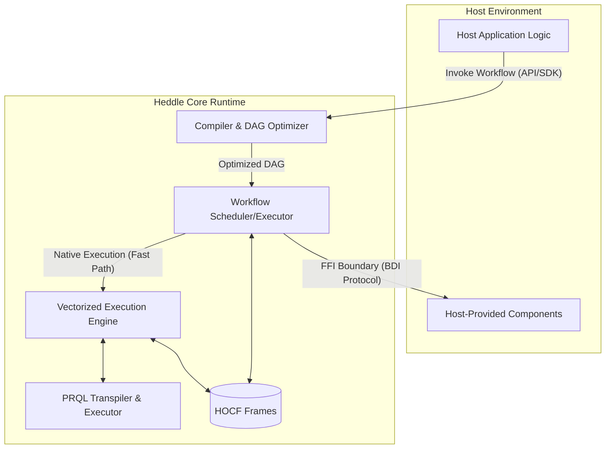

# Heddle Language Specification (v0.1.0)

## 1. Introduction

### 1.1. Overview
Heddle is a statically-typed, declarative, data-flow orchestration language engineered for constructing high-throughput, resilient data integration and processing pipelines. It provides a specialized Domain-Specific Language (DSL) for composing heterogeneous components into coherent execution graphs. Heddle's architecture is predicated on a high-performance, in-memory columnar data format, ensuring efficiency, type safety, and optimized execution.

### 1.2. Design Tenets
Heddle is governed by the following architectural principles:

1. **Columnar-Native Execution**: The Heddle type system and runtime are optimized for columnar data processing. All intermediate data representations utilize the Heddle Optimized Columnar Format (HOCF). This design facilitates vectorized execution (SIMD optimization) and minimizes memory bandwidth utilization through efficient data locality and compression.
2. **Declarative Orchestration**: Heddle emphasizes the definition of data dependencies (the "what") over imperative control flow (the "how"). The runtime autonomously manages the scheduling and optimization of the execution graph—a Directed Acyclic Graph (DAG).
3. **Embedded Core Architecture**: Heddle is designed as an embeddable execution engine, not a monolithic runtime. It integrates seamlessly with host environments (e.g., Python, Go, Rust) via Foreign Function Interfaces (FFI) or WebAssembly (Wasm) deployment targets.
4. **Integrated Transformation**: Heddle natively incorporates PRQL (Pipelined Relational Query Language) for complex data shaping (e.g., joins, aggregations, window functions), leveraging a robust, existing query language rather than introducing a bespoke transformation syntax.

### 1.3. Scope
Heddle is optimized for scenarios requiring high-performance orchestration of structured data, including ETL/ELT pipelines, real-time event stream processing, and backend service coordination.

### 1.4. Terminology

| Term | Definition |
| :------- | :------ |
| Component  | An abstract, side-effecting function provided by a module (built-in or host-provided) that performs a specific operation (e.g., `http.get`, `db.write`). |
| Step  | A named, configured, immutable instance of a Component within a Workflow. Represents a node in the execution DAG.  |
| Workflow | A namespaced execution boundary containing a collection of Steps and the definitions of their data dependencies. |
| Pipeline |  The explicit flow of data between Steps, primarily defined using the `\|` operator. |
| HOCF | Heddle Optimized Columnar Format. The standardized, high-performance in-memory format used by the Heddle runtime. |
| Frame | The fundamental unit of data in Heddle. A strongly-typed, immutable collection of columnar data organized according to the HOCF specification. |
| Workflow Context | The immutable runtime state that persists the output (a Frame) of every executed Step, making intermediate results addressable throughout the Workflow execution. |
| Host Language | The external environment (e.g., Python) in which the Heddle Runtime is embedded. | 
| Heddle Core Runtime (HCR) | The execution engine responsible for parsing, compiling, optimizing, and executing Heddle code. |

## 2. Architecture and Execution Model

### 2.1. Embedded Core Architecture

Heddle operates on a dual-environment model, strictly segregating the declarative orchestration layer (managed by the HCR) from the imperative execution layer (provided by the Host Language).


The HCR manages the workflow lifecycle, optimization, and scheduling. The Host Environment is responsible for invoking the HCR and providing concrete implementations for specific external components (e.g., proprietary business logic).

### 2.2. Performance Model (Dual Path Execution)
Heddle optimizes execution by maximizing operations within the HCR and minimizing costly boundary crossings to the Host Environment.

1. **Fast Path (Vectorized Execution)**: Operations executed entirely within the HCR (e.g., PRQL transformations, built-in Heddle modules). These operations leverage the HOCF columnar format and vectorized processing (SIMD), incurring zero FFI overhead and maintaining high CPU cache locality.
2. **Slow Path (Host Interop)**: Execution that necessitates calling back into the Host Environment (the "Imperative Escape Hatch"). This path inherently involves FFI overhead. Heddle mitigates this performance penalty by utilizing the Binary Data Interchange (BDI) protocol. The BDI protocol defines a standardized memory layout for HOCF, allowing for the zero-copy exchange of Frames between the HCR and the host language memory space, provided the host language supports the protocol.

### 2.3. Execution Model (DAG)
A Heddle `workflow` definition is compiled into a Directed Acyclic Graph (DAG). Nodes in the DAG represent Steps, and edges represent explicit data dependencies. The HCR executes the DAG by performing a topological sort and scheduling nodes for execution concurrently as their upstream dependencies are satisfied.

### 2.4. Workflow Context and Non-Linear Flows
The **Workflow Context** is an immutable, append-only key-value store maintained for the lifecycle of a workflow execution. When a `step` successfully executes, its output (a Frame) is persisted in the Workflow Context, indexed by the step's identifier.

This mechanism enables subsequent steps to reference the results of any previously executed step, facilitating complex, non-linear execution topologies (e.g., fan-out/fan-in patterns, complex joins) beyond simple linear pipelines.

## 3. Language Specification
### 3.1. Modules and Imports

Heddle employs a hierarchical module system for namespace management. The `import` statement brings external modules into the current scope.

```
// Syntax: import "<module_path>" [as <alias>]

import "io/http" as http
import "core/transform"
```

### 3.2. Workflows
The `workflow` block defines a distinct execution boundary and a local namespace. It serves as the entry point for execution.

```
workflow UserProcessingPipeline {
  // Step definitions and pipeline declarations
}
```

### 3.3. Steps (Component Instantiation)
The `step` keyword declares a configured, immutable instance of a component. This is conceptually similar to partial application, where configuration parameters are bound at compile time.

```
// Syntax: step <identifier> = <module>.<component> { <configuration_block> }

step fetch_users = http.get {
    url: "https://api.example.com/v1/users",
    headers: {
        "Authorization": "Bearer <token>"
    }
}
```

### 3.4. The Pipeline Operator (`|`)
The pipeline operator (`|`) defines the primary synchronous data flow. It directs the output Frame of the left-hand side (LHS) expression to become the primary input Frame of the right-hand side (RHS) expression.
```
fetch_users | validate_schema | load_into_warehouse
```

### 3.5. Data Transformation (PRQL Integration)
Heddle delegates complex relational data shaping to embedded PRQL blocks, denoted by parentheses `(...)` within a pipeline.

#### 3.5.1. Contextual Access in PRQL
PRQL blocks utilize specific semantics to access data Frames within the Heddle environment:
1. **Pipelined Input**: Data passed via the pipeline operator (`|`) is accessed using the reserved `input` relation keyword.
2. **Workflow Context**: Data stored in the Workflow Context is accessed by referencing the corresponding `step` name as a relation.

```
step users = db.query { sql: "SELECT * FROM users" }
step events = kafka.read { topic: "user_events" }

// 'events' output is piped into the PRQL block as 'input'
events | (
    # PRQL Block
    from input # Refers to the Frame piped from the 'events' step
    join users (user_id == id) # Refers to the Frame output of the 'users' step (from context)
    group {users.country} (
        aggregate {
            event_count = count
        }
    )
) | update_analytics_dashboard
```
**Semantic Note**: The Heddle compiler performs static analysis on the PRQL references (including `input` and named steps) to construct the execution DAG dependencies. This guarantees that all referenced relations (e.g., `users` and `events`) are resolved (executed) before the PRQL transformation is initiated.

## 4. Type System
Heddle employs a strong, static type system optimized for structured, columnar data processing. The type system ensures compile-time verification of data contracts and guarantees memory layout compatibility required for the Heddle Optimized Columnar Format (HOCF).

### 4.1. Primitive Types
Primitive types represent fixed-size scalar values suitable for efficient columnar storage and vectorized operations.

| Heddle Type    | Description      | Physical Representation (Default) | 
| :-------       | :------          | :------ |
| `int`          | Signed integer   | `Int64` (Explicit `int8`, `int16`, `int32`, `int64` supported) |
| `unit`         | Unsigned integer | `UInt64` (Explicit `uint8`, `uint16`, `uint32`, `uint64` supported)
| `float`        | Floating-point number | `Float64` (Explicit `float32`, `float64` supported) |
| `string`       | Variable-length text |	UTF-8 encoded bytes |
| `bool`         | Boolean value | Packed bit array or Int8 equivalent |
| `timestamp`    | Date and time | Nanoseconds since epoch (with optional timezone metadata) |
| `date`         |  Calendar date | Days since epoch |
| `time`         | Time of day | Nanoseconds since midnight |
| `bytes`        | Raw binary data | Variable-length byte array |
| `ecimal<P, S>` | Fixed-precision decimal | `Decimal128` or `Decimal256` |

### 4.2. Complex Types (Container Types)

Complex types allow for nested and hierarchical data structures.

| Heddle Type       | Description | 
| :-------          | :------ |
| `list<T>`,        | An ordered, homogeneous sequence of elements of type T. |
| `map<K, V>`       | A collection of key-value pairs. Keys (K) must be a primitive, non-nullable type. | 
| `{field: T, ...}` | A Struct (Record). An inline definition of a fixed, ordered collection of named fields, each with a specific type T. | 

### 4.3. Schema Declaration
The `schema` keyword defines a reusable type definition for a Frame structure. Schemas define the expected structure and types of data flowing between steps.
```
schema UserProfile = {
  user_id: int,
  username: string,
  metadata: {
      created_at: timestamp,
      tags: list<string>
  }
}
```

### 4.4. Type Annotations and Static Analysis
`step` declarations can be annotated with input and output schemas using a functional signature syntax to enforce type contracts.

```
// Syntax: step <identifier> [ (<InputSchema>) ] -> <OutputSchema> = <module>.<component> { ... }

// Output annotation: Ensures http.get returns data conforming to UserProfile
step get_users -> UserProfile = http.get { ... }

// Input/Output annotation: Input acts as an assertion on data entering the step.
step calculate_scores (UserProfile) -> UserScore = transform.prql {
    query: "from input | derive score = metrics.login_count * 1.5"
}
```

The Heddle compiler performs rigorous static analysis to verify schema compatibility between connected steps. Type mismatches (including incompatible nullability) result in compilation errors, preventing runtime failures due to incompatible data structures.

## 5. Runtime Features and Resilience
### 5.1. Compilation and Optimization
The HCR compiles Heddle source code into an optimized execution DAG. Key optimization strategies include:
* **Operator Fusion**: Combining multiple sequential operations (e.g., adjacent PRQL blocks, sequential filters, or projections) into a single execution unit. This minimizes intermediate data materialization and improves data locality.
* **Predicate/Projection Pushdown**: Analyzing the DAG to push filtering (predicates) and column selection (projections) as close to the data source as possible, reducing the volume of data processed downstream.
* **Automatic Parallelization**: Analyzing the DAG structure to identify independent branches (Steps without data dependencies on each other) that can be executed concurrently on available cores.

### 5.2. Error Handling
Heddle provides granular mechanisms for handling exceptions at both the local (step invocation) and global (workflow) levels.

#### 5.2.1. Local Error Handling (Try-Catch Operator)
The `?` operator can be suffixed to a `step` invocation within a pipeline to intercept errors originating specifically from that invocation. This allows for distinct error-handling strategies tailored to the context of the invocation.

```
// Syntax: <step_invocation> ? <error_variable> -> { <handler_block> }

step process_data = external.api_call { ... }

// Attach the handler at the specific invocation point
process_data ? e -> {
    log.error { message: "API call failed", error_details: e }
    // The handler block can return a fallback Frame or re-throw the exception
    return fallback_data_frame
} | finalize
```
If an error occurs in `process_data`, the execution flow for that specific data payload is transferred to the associated handler block.

#### 5.2.2. Global Error Handlers
A workflow can define a global error handler block (`catch`) that intercepts any exceptions not handled locally. This is utilized for centralized logging, alerting, and graceful workflow termination.
```
workflow MainPipeline {
    // ... steps ...
} catch e -> {
  alert.slack { message: "Pipeline Failed", details: e }
}
```

### 5.3. Memory Management and Spilling (Out-of-Core Execution)
The HCR implements advanced memory management for the Workflow Context. To ensure robustness when processing datasets that exceed available physical RAM, the HCR employs the following strategies:

* **Buffer Pooling and Recycling**: Minimizing memory allocation overhead and fragmentation by reusing standardized memory buffers optimized for the HOCF layout.
* **Data Spilling**: Transparently moving intermediate Frames (states) from RAM to fast local storage (e.g., NVMe SSD) when memory pressure thresholds are exceeded. The HCR utilizes highly efficient, compressible columnar formats (such as Parquet or an optimized HOCF binary serialization) for spilled data to minimize I/O overhead.

## 6. Observability and Tooling
### 6.1. Execution Modes
The Heddle runtime supports distinct execution modes to balance performance requirements with introspection needs.
* **Production Mode (Default)**: Prioritizes maximum throughput and minimal resource utilization. The compiler applies aggressive optimizations (e.g., operator fusion). Intermediate states in the Workflow Context may be ephemeral, and memory buffers are recycled aggressively once downstream dependencies are satisfied.
* **Debug Mode**: Prioritizes observability and traceability. Operator fusion is disabled. The runtime guarantees that the intermediate state (the exact Frame) after every step execution is materialized and preserved in the Workflow Context until the workflow completes.

### 6.2. Introspection API
When operating in Debug Mode, the HCR exposes an Introspection API (accessible via the Host SDK). This API allows developers and tooling environments (e.g., IDEs) to:

1. Inspect the compiled DAG structure (both logical and physical execution plans).
2. Set breakpoints before or after the execution of specific steps.
3. Query the Workflow Context to view the exact Frame state (data and schema) at any point in the execution timeline.
4. Trace data lineage across steps, facilitating root cause analysis.

## 7. Ecosystem and Roadmap
The evolution of Heddle will focus on expanding its connectivity, runtime capabilities, and developer experience.

### 7.1. Package Management
Development of a centralized package repository and a dedicated package manager (CLI) for distributing Heddle modules, schemas, and component implementations (including necessary host-specific libraries).

### 7.2. Runtime Implementations and SDKs
Expansion of official SDK support and HCR bindings for major host languages, categorized by the efficiency of the Binary Data Interchange (BDI) protocol implementation:

* **Tier 1 (Full BDI Zero-Copy support)**: Languages capable of supporting high-performance, zero-copy memory sharing (e.g., Rust, C++, Go, Python with native extensions).
* **Tier 2 (Wasm/Serialization required)**: Environments where direct memory access is restricted, requiring Wasm deployment or data serialization across the boundary (e.g., Node.js/TypeScript, Java/JVM).

### 7.3. Core Module Expansion
Development of a comprehensive standard library (`stdlib`) of modules for common I/O and processing operations:
* Databases: Relational (PostgreSQL, MySQL) and Columnar/OLAP (ClickHouse, DuckDB).
* Messaging/Events: Kafka, RabbitMQ, NATS, SQS.
* Networking: Advanced HTTP/gRPC clients with resilience patterns (retries, circuit breakers).
* File Formats: Parquet, ORC, CSV, JSON, Avro.

### 7.4. AI-Powered Tooling
The declarative, strongly-typed nature of Heddle makes it an ideal Intermediate Representation (IR) for generative AI tooling. Future development will focus on LLM-powered code generation (natural language to Heddle), automated optimization suggestions, and dynamic documentation generation.

### 7.5. Research and Collaboration
Heddle invites community and academic collaboration, particularly in areas such as advanced compiler optimizations (e.g., cost-based optimization for distributed execution, cross-language operator fusion) and programming language theory (e.g., formalizing the type system and exploring advanced effect systems for side-effect management).