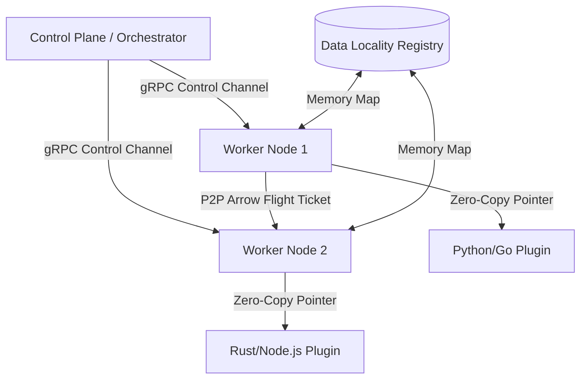

# Heddle: The High-Performance Orchestration Weave

[](https://pkg.go.dev/github.com/galgotech/heddle-lang)
[](https://www.gnu.org/licenses/gpl-3.0)
[]()

Heddle is a strictly-typed, domain-specific programming language (**DSL**) and high-performance orchestration engine designed to eliminate maintenance debt in distributed systems. The engine coordinates execution flows and unifies multi-language applications through robust, statically validated interfaces. By separating the control plane from the physical data stream, Heddle delivers near-zero serialization overhead.

Standard microservice architectures often suffer from excessive CPU consumption due to JSON serialization and untyped pipelines. Heddle addresses these challenges by sharing direct memory addresses across language runtimes without byte copying. This approach allows developers to integrate safe, declarative workflows with native performance.

## Document Scope

This document defines the boundary of the primary Heddle compiler repository.

### Scope and Non-Scope

This document outlines specific areas of coverage:
- **Scope**: Covers compiler operations, execution coordination via Cobra CLI, backend LSP/DAP engines, and shared core libraries.
- **Non-Scope**: Excludes specific external SDK implementations for Python, Rust, Node.js, and detailed language syntax specifications, which reside in the `./docs/` directory.

### Key Capabilities

Heddle provides several unique features that differentiate the engine from standard orchestrators:
- **Zero-Copy Memory Exchange**: Employs **Apache Arrow** and **Arrow Flight** to stream record batches at the speed of local random-access memory (**RAM**).
- **Static Contract Safety**: Detects type conflicts and syntax errors during compilation, eliminating runtime failures.
- **Direct Peer-to-Peer Data Resolution**: Worker nodes route data directly between each other, which prevents central bandwidth bottlenecks.
- **Operator Fusion**: The compiler fuses contiguous execution steps into atomic units to reduce inter-process communication overhead.
- **Fail-Safe Isolation**: Utilizes retry individual failed steps rather than re-running entire graphs.

---

## Visual Architecture

The following diagram illustrates the relationship between the central Control Plane and polyglot workers:



---

## Heddle in Action

The Heddle Domain-Specific Language (**DSL**) defines resources, bound steps, and structured directed acyclic graph (**DAG**) execution flows. The language integrates Pipelined Relational Query Language (**PRQL**) directly for side-effect-free data transformations. 

The following code defines a complete transaction audit pipeline (`fraud_detection.he`):

```heddle
import "fhub/kafka" kafka
import "fhub/postgresql" pg
import "fhub/clickhouse" ch
import "fhub/llm" openai
import "fraud-score/detect" fraud_detection

// 1. Centralized Resources (State/Connections)
resource pg_db = pg.connection {
  host: "pg.internal"
} 

resource ch_db = ch.connection {
  host: "ch.internal"
}

resource kf_broker = kafka.connection {
  broker: "kafka.internal:9092"
}

// 2. Bound Imperative Steps with Resource Injection
step fetch_user_data = <connection=pg_db> pg.query {
  query: "SELECT id AS user_id, country FROM users WHERE id = @user_id"
}

step fetch_risk_profile = <connection=ch_db> ch.query {
  query: "SELECT user_id, velocity_score FROM risk_metrics WHERE user_id = @user_id"
}

step generate_audit = openai.prompt {
  system: "Analyze transaction, location, and velocity score. Generate a fraud audit text report."
}

// Global error catcher
handler alert_on_fail {
  *
    | kafka.produce <broker=kf_broker> { topic: "dlq_alerts" }
}

// Step error catcher
handler alert_step_fail {
  *
    | kafka.produce <broker=kf_broker> { topic: "dlq_alerts" }
}

// 3. Strict DAG Workflow
workflow FraudDetection ? alert_on_fail {
  kafka.consume <broker=kf_broker> { topic: "live_transactions" }
  > tx_stream

  tx_stream
    | (
        from input
        filter amount > 10000
        select {user_id, amount}
      ) 
    | fraud_detection.process ? alert_step_fail
    | (
        from input
        join fetch_user_data (==user_id)
        join fetch_risk_profile (==user_id)
      )
    | generate_audit
    | kafka.produce <broker=kf_broker> { topic: "fraud_audits" }
}
```

---

## Installation

To compile and run Heddle, you must prepare the local system environment. Ensure that your system meets the specific requirements listed below:

### Prerequisites

You must install the following software packages before building Heddle:
- Go compiler version 1.26 or higher
- GNU Make build utility version 4.0 or higher

### Build Steps

Follow these numbered steps to build the Heddle command-line interface (**CLI**):

1. Clone the repository to your local machine using git.
2. Run the build recipe in the project root directory:
   ```bash
   make build
   ```
3. Verify that the compilation created the CLI binary:
   ```bash
   ./bin/heddle --help
   ```
4. Run all unit and integration tests to confirm system stability:
   ```bash
   make test
   ```

---

## Command-Line Interface (CLI) Usage

The Heddle CLI is the primary entry point to manage, inspect, and run orchestration tasks. 

The following list details the supported subcommands:
- `heddle run <script>`: Executes a Heddle DSL script directly.
- `heddle local`: Starts a local, single-node execution environment.
- `heddle cluster`: Configures and launches a multi-node cluster deployment.
- `heddle dev`: Launches local developer daemons including the LSP and DAP servers.
- `heddle inspect`: Examines the abstract syntax tree (**AST**) and compiled intermediate representation (**IR**).
- `heddle workflow`: Manages and lists current active workflow definitions.

---

## Architecture and Engine Internals

Heddle separates logical orchestration from physical data execution to deliver high throughput and reliability. The architecture is divided into three key systems:

### 1. Control Plane (Orchestration)

The Control Plane acts as the central coordinator for the environment. It manages global execution state and routing decisions without directly reading or writing raw user payloads. This separation ensures that management overhead remains low even during intensive data operations.

The Control Plane operates with the following design patterns:
- **DAG Optimization**: Compiles the DSL into a logical Directed Acyclic Graph (**DAG**) and applies Operator Fusion to minimize worker communication.
- **JIT Provisioning**: Loads execution code into stateless workers using Just-In-Time (**JIT**) mechanics, caching binaries locally to ensure zero warm-up latency.
- **Failure Quarantine**: Employs isolate faulty step executions, allowing localized retries without re-running the entire workflow.

### 2. Polyglot Workers (Execution)

Worker nodes process the physical data streams assigned by the Control Plane. Each node communicates with language-specific executors to execute step logic. The system balances tasks across available cluster resources to ensure execution efficiency.

Worker nodes leverage the following execution principles:
- **Main Daemon**: Runs as a background service on host nodes, coordinating tasks and managing the lifecycles of active executor plugins.
- **SDK Plugins**: Execute language-specific step implementations inside independent processes.
- **P2P Data Sharing**: Workers exchange Apache Arrow metadata to retrieve physical pointers, bypassing the Control Plane during high-speed data handoffs.

### 3. Data Locality Registry (Memory Management)

Inspired by the **Vineyard (v6d)** shared memory manager, this subsystem acts as an optimized memory-mapping layer. It tracks physical memory handles to coordinate zero-copy transitions across step boundaries. The manager automatically purges unused tables to free system resources.

The registry implements the following memory optimization mechanisms:
- **Zero-Copy Routing**: Maps workflow step outputs to local RAM addresses, enabling multi-process access without serialization overhead.
- **Dynamic Offloading**: Transfers massive data frames from RAM to persistent disk storage when physical limits are exceeded.
- **Automatic Garbage Collection**: Cleans up intermediate shared memory tables once all downstream consumer steps complete their executions.

---

## Communication Protocols

Heddle coordinates operations across distributed networks and local memory maps using distinct communication channels.

### 1. Control Channel (Control Plane ↔ Worker)

The Control Channel coordinates the administrative lifecycles of scheduled jobs. It ensures that the central orchestrator remains aware of worker capacities and active execution states. This layer isolates admin traffic from data traffic to prevent message bottlenecks.

The Control Channel operates with the following specifications:
- **Transport Protocol**: Employs high-performance **gRPC** for low-latency command exchange.
- **Payload Contents**: Transmits execution states, resource registrations, and compiled step bytecode.

### 2. Data Plane (Worker ↔ Worker / Data Locality Registry)

The Data Plane transfers physical datasets between worker environments. It processes massive columnar streams without invoking CPU-intensive serialization loops. Workers fetch memory handles directly using metadata tokens for high-speed resolution.

The Data Plane utilizes the following routing mechanisms:
- **Transport Protocol**: Employs **Apache Arrow Flight** to stream columnar record batches.
- **Zero-Copy Routing**: Uses Unix Domain Sockets (**UDS**) and shared memory allocations on local hosts to bypass network stacks.
- **Network Streaming**: Switches to high-speed TCP streams when transmitting record batches between different physical nodes in a cluster.

---

## Polyglot SDK Implementations

Heddle provides native software development kits (**SDKs**) to write custom step and resource definitions in Python, Go, Node.js (TypeScript), and Rust. All SDKs leverage the Apache Arrow memory layout to guarantee zero-copy efficiency.

---

## License

Heddle is distributed under the GNU General Public License Version 3 (GPLv3). See the [LICENSE](LICENSE) file for the complete terms and conditions:
